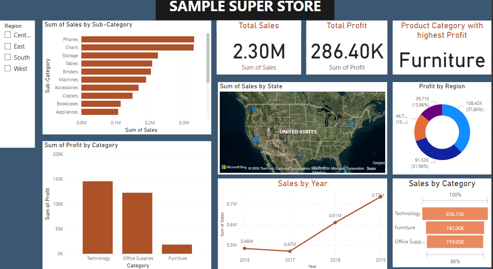

# Data Analytics Portfolio
# Project 1

**Title:** [Super store Dashboard](https://github.com/Bonifacenwa/bnwanganga.github.io/blob/main/SUPERSTORE%20DASHBOARD.pbix)

**Tools Used:** Power Bi (Cards, slicers, Charts, Timelines)

**Project Description:** This project involved analysing sales data of a company to identify trends and patterns in sales performance. It is designed to provide a comprehensive overview of key performance metrics. This dashboard allows stakeholders to easily monitor and analyze the company’s performance across different regions, products, and time periods. The dashboard includes the following features:
Profit by Country and Cookies: Visual representation of profits broken down by each country and type of cookie.
Total Units Sold per Month: A monthly breakdown of the total units sold, providing insights into sales trends over time.
Profit by Month: Displays the monthly profit, allowing for easy comparison of profitability throughout the year.
Total Revenue by Country: Highlights the total revenue generated in each country, showcasing the performance in different markets.
Additionally, the dashboard includes interactive slicers and timeline for:
Region: Focus on specific regions to analyze regional performance.

**Key findings:** Regional Profitability: Identified the most profitable countries and highlighted regions where performance could be improved.
Seasonal Trends: Revealed patterns in sales and profit that correspond with seasonal events, allowing for more strategic planning.
Top-Performing Products: Highlighted which cookie products are driving the most revenue and profit, aiding in inventory and marketing decisions.
Sales Volatility: Analyzed monthly sales fluctuations to understand market dynamics and adjust business strategies accordingly.
This dashboard serves as a crucial tool for the cookies company’s management team, providing clear, actionable insights that drive informed decision-making and strategic planning.

**Dashboard Overview:** 

# Project 2
**Title:** Employee details and salary interogation

**SQL Code:** [Employee details queries]

**SQL Skills Used:**

**Project Description:**

**Technology used: SQL server**
